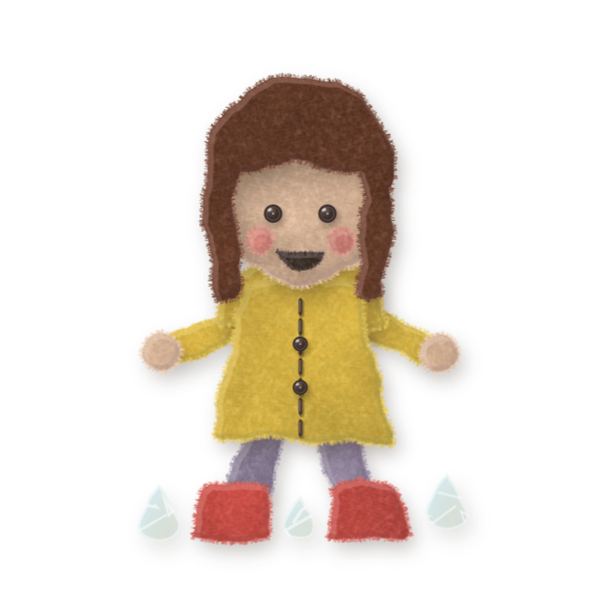
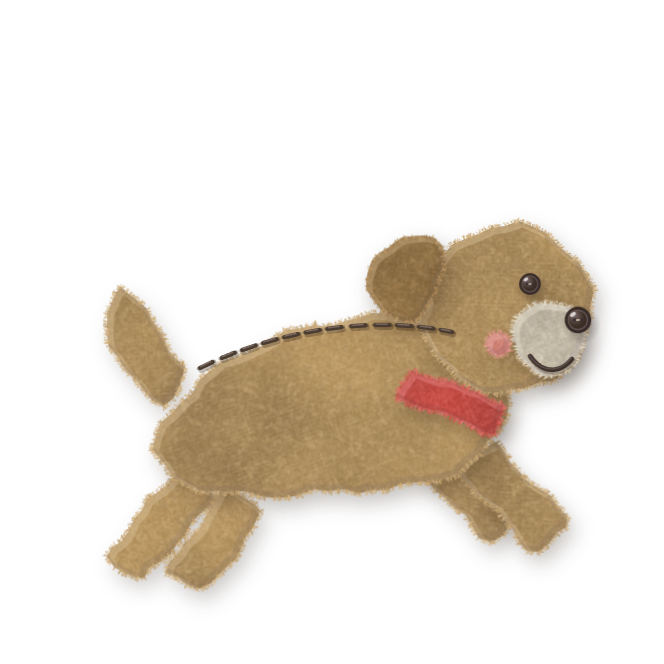
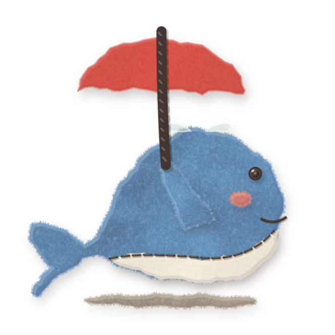
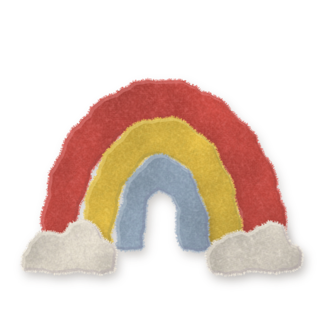
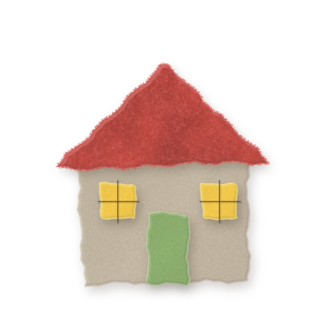
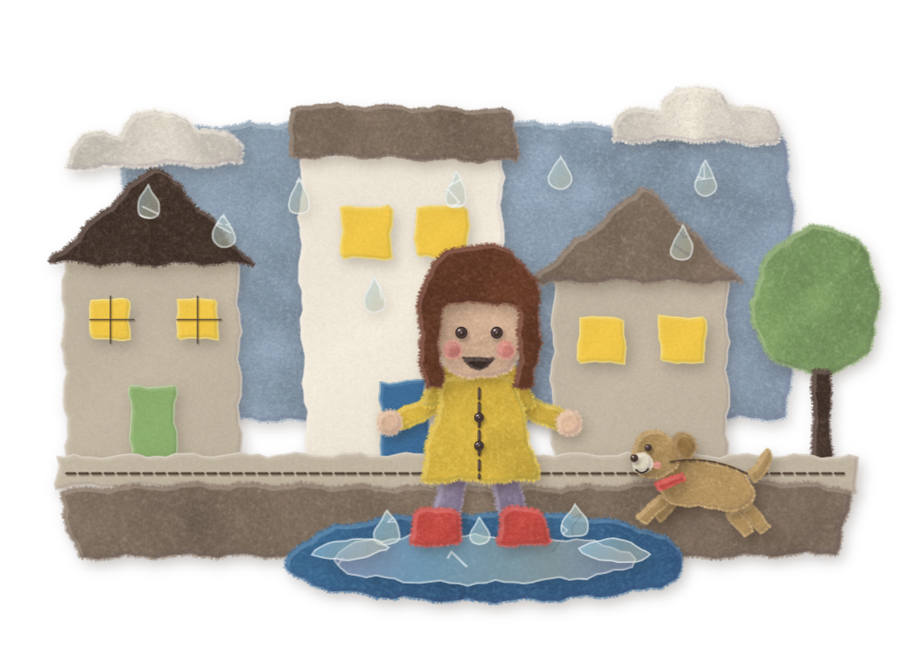

# crafterAssetLibrary

**Free felt-craft assets for anyone making things for kids.** Hand-cut felt, cardstock, cotton prints and
cellophane: characters, everyday items, example scenes, materials and paper textures. Everything is
**CC0**, so you can use it for anything, commercial or not, without asking or crediting (credit is always welcome).

<p>
  
  
  
  
  
</p>


## What's inside

| folder | what | formats |
|---|---|---|
| `characters/avatar` | the writer: stand, wave, sit, jump, splash | PNG (felt render) · flat SVG · source SVG |
| `characters/companion` | a pet companion: stand, jump, sit | same |
| `characters/mascot` | a whale mascot: sit, umbrella, peek, sleep, wave | same |
| `items/` | heart, star, rainbow, butterfly, flower, cloud, raindrop, sun, house, tree | same |
| `scenes/` | three example collages (rainy street, grandma's kitchen, beach) + a spot item each | PNG · flat SVG · source SVG |
| `materials/` | felt, cotton prints, cardstock, burlap, denim, cellophane, paper, stitches, button eyes, tag, banner, note | PNG |
| `textures/` | cream cardstock paper, a multiply paper grain, felt and woven cloth | PNG |
| `tokens/` | the palette, fonts and craft settings | JSON · CSS variables |
| `manifest.json` | every asset with type, tags and description, so tools (and AI agents) can search before they draw | JSON |

Browse everything in [`index.html`](index.html) (open it through any static server, or enable GitHub Pages).

## Three ways to use it

1. **Just the pictures.** Drop the PNGs into a slide, a worksheet, a game or a sticker sheet. They have
   transparent backgrounds and soft cut-paper shadows.
2. **Flat vectors.** The `svg/` folders hold plain coloured SVGs for Figma, Illustrator or the web. Recolour them freely.
3. **Source SVGs for generative tools.** The `source/` SVGs are data: every path is one cut piece with a colour
   key, a material, stitches and motion hints (see [docs/SVG-CONVENTIONS.md](docs/SVG-CONVENTIONS.md)). A renderer
   can turn them into felt; an LLM can write new ones in the same format ([docs/GENERATING.md](docs/GENERATING.md)).

## The idea: reuse before you generate

Generating art for every page is slow and expensive, and it drifts in style. This library is built to be the
**first place a pipeline looks**:

1. search `manifest.json` for the thing you need (tags and descriptions);
2. reuse it if it exists: free, instant and consistent;
3. only if it's missing, generate **one** new piece in the same conventions and add it back here.

Every addition makes the next page cheaper. Please contribute what you make: see [CONTRIBUTING.md](CONTRIBUTING.md).

## Style in one breath

Few pieces, clean hand-cut edges, real layer shadows, a stitch or two. One colour leads, the rest are dusty
neutrals. Characters are placed, never redrawn, so they look the same every time. Full guide:
[docs/ART-DIRECTION.md](docs/ART-DIRECTION.md).

## Scripts

```bash
node scripts/bake-flat.mjs   # rebuild every flat SVG from the source SVGs (no dependencies)
```

## Fonts

The tokens name Caveat (titles), Kalam (handwriting) and Jost (print). All three are free under the SIL Open
Font License on Google Fonts. They are not bundled here.

## Licence

[CC0 1.0 Universal](LICENSE): no rights reserved. Made with care for kids who like to write.
